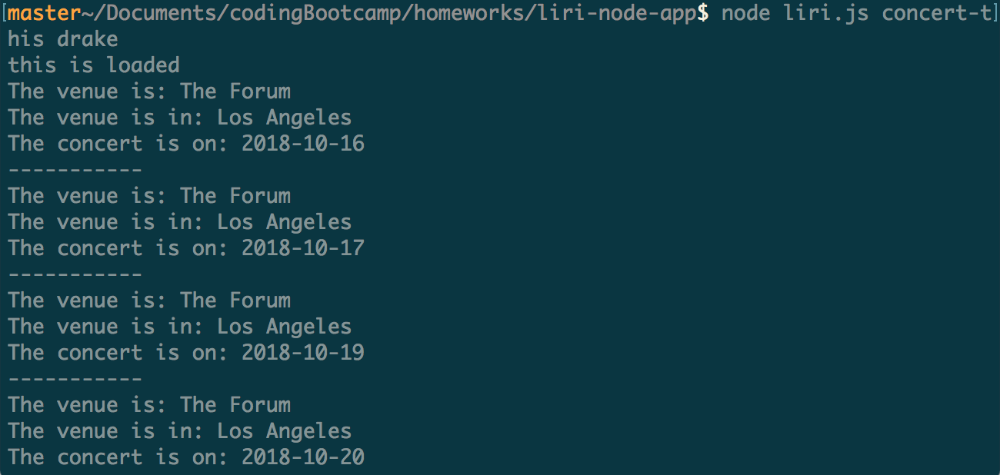
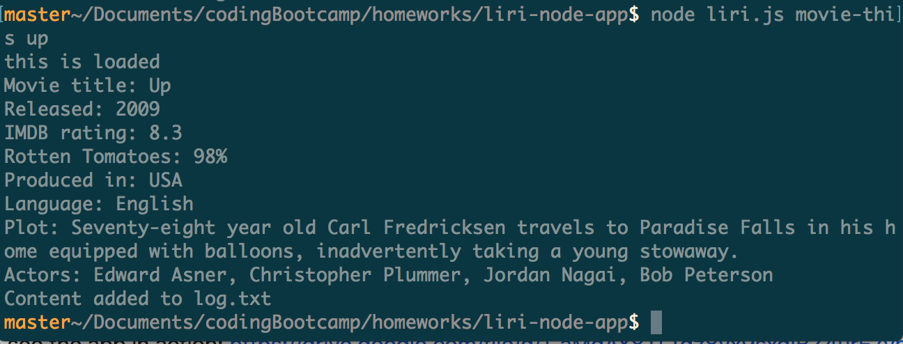
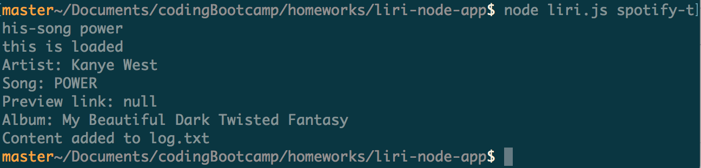
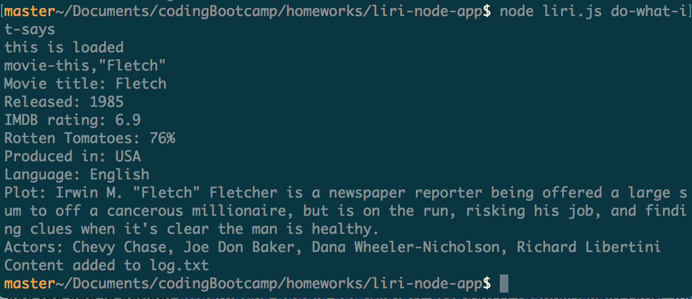

# liri-node-app

To see the app in action: https://drive.google.com/file/d/1_aMdAY8TLTdz8vx9sxdIBZ4urE7vmjvE/view?usp=sharing

### Overview

LIRI: like iPhone's SIRI, but a _Language_ Interpretation and Recognition Interface. LIRI is a command line node app that takes in parameters and gives you back data.

You can search for concerts for a particular artist using the Bands In Town API, movies using the OMDB API and songs using the Spotify API.

### Command line functions

To search an artist for upcoming concerts: node liri.js concert-this "[artist name]"

example:

To search a movie: node liri.js movie-this "[movie name]"

example:

 
To search a song: node liri.js spotify-this-song "[song name]"

example:

To do a preset search read from a txt file: node liri.js do-what-it-says

example:

